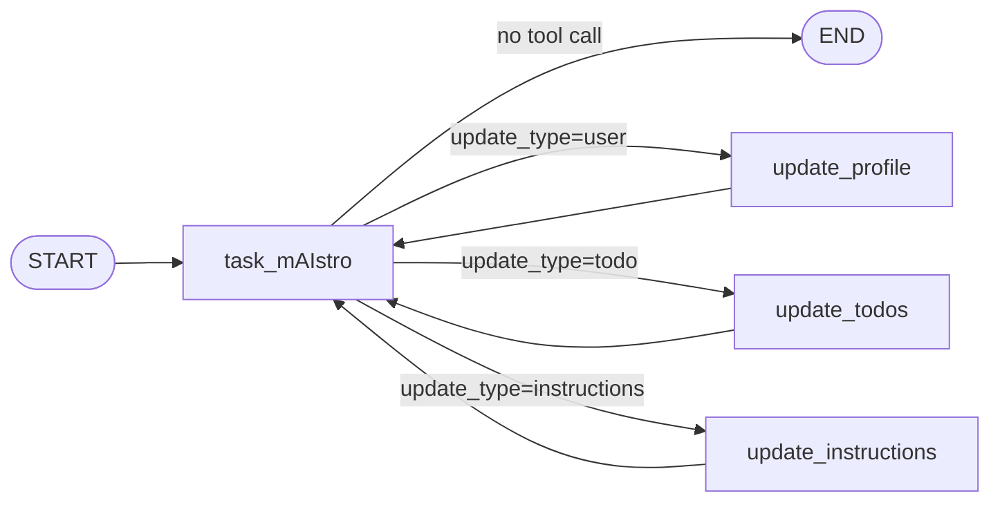
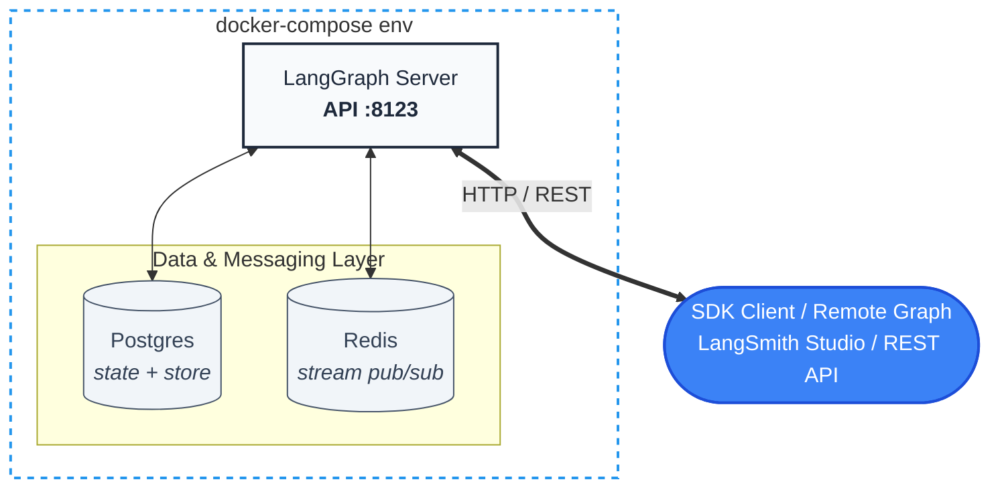
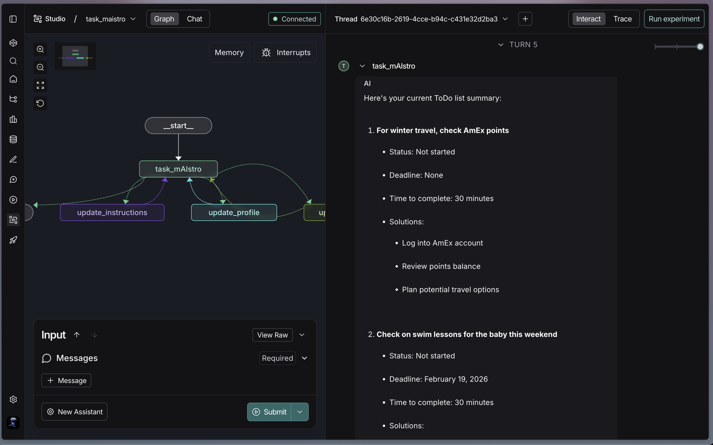
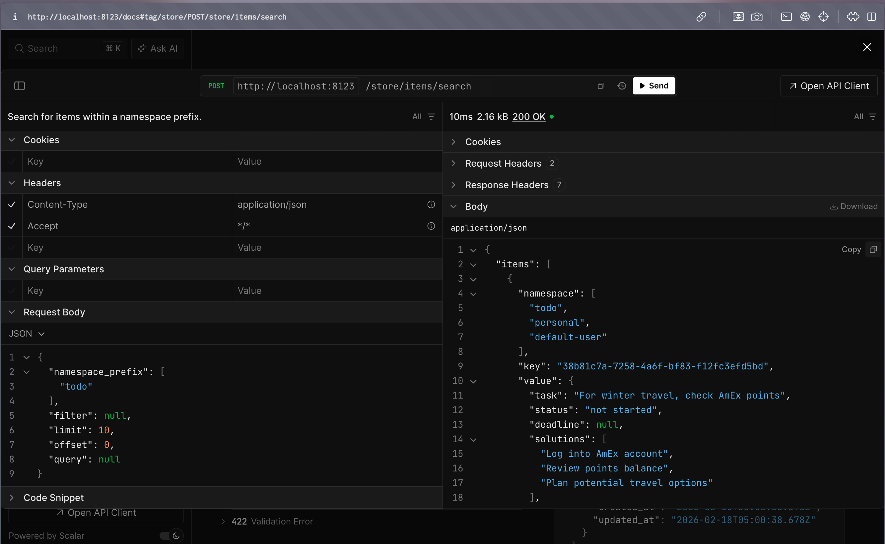

# task mAIstro

A personalized AI task management assistant built with LangGraph. It maintains a persistent memory of your profile, to-do list, and custom preferences — deployed as a production service backed by Postgres and Redis.

[](https://www.python.org/downloads/)
[](https://github.com/astral-sh/uv)

## How It Works

The agent runs a continuous conversation loop. On every message it decides what (if anything) to remember, then responds naturally.

**Memory is split across three namespaces per user:**

1. **Profile** — name, location, job, connections, interests
2. **ToDo list** — tasks with deadlines, estimated time, solutions, and status
3. **Instructions** — user-defined preferences for how the to-do list should be managed

**On each turn:**

1. The `task_mAIstro` node loads all three memory namespaces from the store and calls `gpt-4o-mini`.
2. The model decides whether to call the `UpdateMemory` tool (`user`, `todo`, or `instructions`).
3. A conditional edge routes to the appropriate update node (`update_profile`, `update_todos`, or `update_instructions`).
4. [Trustcall](https://github.com/hinthornw/trustcall) is used for structured, patch-based extraction — it updates existing records rather than overwriting them.
5. After the update, control returns to `task_mAIstro` for a natural-language reply.



### Deployment Architecture

The graph runs as a containerized service. Three containers are orchestrated via Docker Compose:



| Container | Purpose |
|---|---|
| `langgraph-api` | Serves the graph over HTTP via the LangGraph Server |
| `langgraph-postgres` | Persists threads, checkpoints, store items, and assistants |
| `langgraph-redis` | Enables token streaming via pub/sub during graph execution |

## Setup

**Prerequisites:** Python 3.13+, [`uv`](https://github.com/astral-sh/uv), [Docker](https://docs.docker.com/engine/install/)

**1. Clone and install dependencies**

```bash
git clone https://github.com/pytholic/langgraph-task-maistro.git
cd langgraph-task-maistro
uv sync
```

**2. Configure environment variables**

```bash
cp .env.example .env
```

Edit `.env` with your API keys:

```bash
OPENAI_API_KEY="..."        # Used by the LLM (gpt-4o-mini)
LANGSMITH_API_KEY="..."     # Used by the LangGraph Server
LANGSMITH_TRACING="true"    # Optional: enable LangSmith tracing
LANGSMITH_PROJECT="default"
```

> Get an OpenAI key at [platform.openai.com](https://platform.openai.com) and a LangSmith key at [smith.langchain.com](https://smith.langchain.com).

**3. Build the Docker image**

```bash
langgraph build -t task-maistro
```

This packages the graph and its dependencies into a Docker image using the `langgraph.json` config.

**4. Launch the service**

```bash
docker compose --env-file .env up
```

This starts all three containers. The LangGraph Server API is available at `http://localhost:8123`.

**5. Access**

| Interface | URL |
|---|---|
| REST API docs | http://localhost:8123/docs |
| LangSmith Studio | https://smith.langchain.com/studio/?baseUrl=http://127.0.0.1:8123 |

## Interacting with the Deployment

There are four ways to interact with the running service:

| Method | Best for |
|---|---|
| **LangSmith Studio** | Visual graph inspection, debugging, manual test runs |
| **REST API** | Direct HTTP calls, exploring available endpoints |
| **LangGraph SDK** | Python/JS scripts and applications |
| **Remote Graph** | Using the graph as a drop-in inside the LangGraph library |

> The `notebooks/` directory contains runnable examples for all of the above. See [`connecting.ipynb`](notebooks/connecting.ipynb) for SDK and API usage, [`assistant.ipynb`](notebooks/assistant.ipynb) for versioned assistants, [`double-texting.ipynb`](notebooks/double-texting.ipynb) for concurrency strategies, and [`creating.ipynb`](notebooks/creating.ipynb) for the full deployment walkthrough.

### LangSmith Studio

Once the service is running, open Studio in your browser — no code needed:

```
https://smith.langchain.com/studio/?baseUrl=http://127.0.0.1:8123
```

You can send messages, inspect state at each checkpoint, view the graph structure, and manage threads and assistants visually.

### REST API

The LangGraph Server exposes a full REST API. Interactive docs (Swagger UI) are available at:

```
http://localhost:8123/docs
```

Useful for exploring endpoints, testing store operations, and querying run or thread status directly via HTTP.

### LangGraph SDK

The [LangGraph SDK](https://docs.langchain.com/langsmith/sdk) (Python and JS) is the primary programmatic interface:

```python
from langgraph_sdk import get_client

client = get_client(url="http://localhost:8123")
```

### Runs

A run is a single execution of the graph. The server supports:

- **Background runs** — fire-and-forget, returns immediately
- **Blocking runs** — waits until execution completes
- **Streaming runs** — token-by-token responses via Redis pub/sub (`stream_mode="messages-tuple"`)

```python
# Background run
run = await client.runs.create(thread_id, "task_maistro", input={"messages": [...]})

# Stream tokens
async for chunk in client.runs.stream(thread_id, "task_maistro", input={...}, stream_mode="messages-tuple"):
    print(chunk)
```

### Threads

Threads support multi-turn conversations. All checkpoints are persisted to Postgres.

```python
thread = await client.threads.create()

# Check state
state = await client.threads.get_state(thread["thread_id"])

# Fork a thread from any checkpoint
new_thread = await client.threads.copy(thread["thread_id"])

# Edit state at a checkpoint and resume
await client.threads.update_state(thread["thread_id"], {"messages": [...]}, as_node="task_mAIstro")
```

### Store (Long-term Memory)

The graph stores memories in Postgres under namespaced keys: `(memory_type, todo_category, user_id)`.

```python
# Search todos
items = await client.store.search_items(("todo", "personal", "lance"))

# Add an item directly
await client.store.put_item(("todo", "work", "lance"), key="my-task", value={...})

# Delete an item
await client.store.delete_item(("todo", "work", "lance"), key="my-task")

# Delete all items
items = await client.store.search_items(("todo", "personal", "default-user"), limit=100)
for item in items["items"]:
    await client.store.delete_item(("todo", "personal", "default-user"), key=item["key"])
```

### Remote Graph

If you're already working inside the LangGraph library, [Remote Graph](https://docs.langchain.com/langsmith/use-remote-graph) lets you use the deployed graph as a drop-in replacement for a local compiled graph — same `.invoke()` / `.stream()` interface:

```python
from langgraph.pregel.remote import RemoteGraph

remote_graph = RemoteGraph("task_maistro", url="http://localhost:8123")

# Use exactly like a local graph
result = await remote_graph.ainvoke(
    {"messages": [{"role": "user", "content": "Add a task to buy groceries"}]},
    config={"configurable": {"user_id": "lance", "todo_category": "personal"}}
)
```

## Assistants

[Assistants](https://docs.langchain.com/langsmith/assistants) let you create multiple versioned configurations from the same graph — perfect for separate personal and work to-do lists.

The graph's `configuration.py` exposes three configurable fields:

| Field | Default | Purpose |
|---|---|---|
| `user_id` | `"default-user"` | Namespaces all memories per user |
| `todo_category` | `"general"` | Separates todo lists (e.g. `personal`, `work`) |
| `task_maistro_role` | task management assistant | System prompt / role for the agent |

```python
# Personal assistant
personal = await client.assistants.create(
    "task_maistro",
    config={"configurable": {"todo_category": "personal", "user_id": "lance"}}
)

# Work assistant with a stricter role (requires deadlines)
work = await client.assistants.create(
    "task_maistro",
    config={
        "configurable": {
            "todo_category": "work",
            "user_id": "lance",
            "task_maistro_role": "You are a task management assistant. Always ask for a deadline before adding a task."
        }
    }
)
```

Both assistants share the same graph but have isolated memory namespaces and different behaviors.

## Double Texting

The server handles concurrent messages gracefully. Four strategies are available when a new message arrives before the previous run completes:

| Strategy | Behavior |
|---|---|
| **Reject** | Returns a 409 error; the previous run continues |
| **Enqueue** | Queues the new run; executes after the current one finishes |
| **Interrupt** | Stops the current run (progress preserved), starts the new one |
| **Rollback** | Deletes the current run entirely, starts fresh with the new input |

```python
# Example: interrupt the current run and start fresh
await client.runs.create(
    thread_id,
    "task_maistro",
    input={"messages": [...]},
    multitask_strategy="interrupt"
)
```

## Project Structure

```
langgraph-task-maistro/
├── src/
│   ├── task_maistro.py         # Graph definition (nodes, edges, state, memory logic)
│   └── __init__.py
├── notebooks/
│   ├── creating.ipynb          # Building and deploying the Docker image
│   ├── connecting.ipynb        # SDK usage: runs, threads, store
│   ├── assistant.ipynb         # Creating and using versioned assistants
│   └── double-texting.ipynb    # Concurrent message handling strategies
├── images/
│   ├── get_run.png
│   └── search_store_items.png
├── configuration.py            # Configurable fields (user_id, todo_category, role)
├── langgraph.json              # LangGraph Server config
├── docker-compose.yml          # Redis + Postgres + LangGraph API
├── pyproject.toml
└── .env.example
```

## Quick Example Run

Go to LangSmit hUi at: https://smith.langchain.com/studio/?baseUrl=http://127.0.0.1:8123

Run the following prompts one-by-one.
```
Input: Create or update few ToDos: 1) Re-film Module 6, lesson 5 by end of day today. 2) Update audioUX by next Monday.

Input: Create another ToDo: Finalize set of report generation tutorials.

Input: OK, for this task let's get it done by next Tuesday.

Input: Create ToDos: 1) Check on swim lessons for the baby this weekend. 2) For winter travel, check AmEx points."

Input: Give me a todo summary.
```

**Example studio run**


**Trace:** 

https://smith.langchain.com/public/ca7c99e4-3b17-42d6-bda1-1c690aca571c/r

**Query in interactive docs**


## Key Dependencies

| Package | Purpose |
|---|---|
| `langgraph` | Graph orchestration and state management |
| `langchain-openai` | LLM (gpt-4o-mini) |
| `trustcall` | Structured patch-based memory extraction |
| `langgraph-cli` | `langgraph build` and `langgraph dev` |

## Key Links

- [LangGraph Platform docs](https://docs.langchain.com/langsmith/self_hosted_data_plane)
- [LangGraph SDK reference](https://reference.langchain.com/python/langsmith/deployment/sdk/)
- [LangGraph CLI](https://docs.langchain.com/langsmith/cli)
- [Assistants](https://docs.langchain.com/langsmith/assistants)
- [Double texting](https://docs.langchain.com/langsmith/double-texting)
- [Trustcall](https://github.com/hinthornw/trustcall)
- [LangSmith Studio](https://smith.langchain.com/studio)
